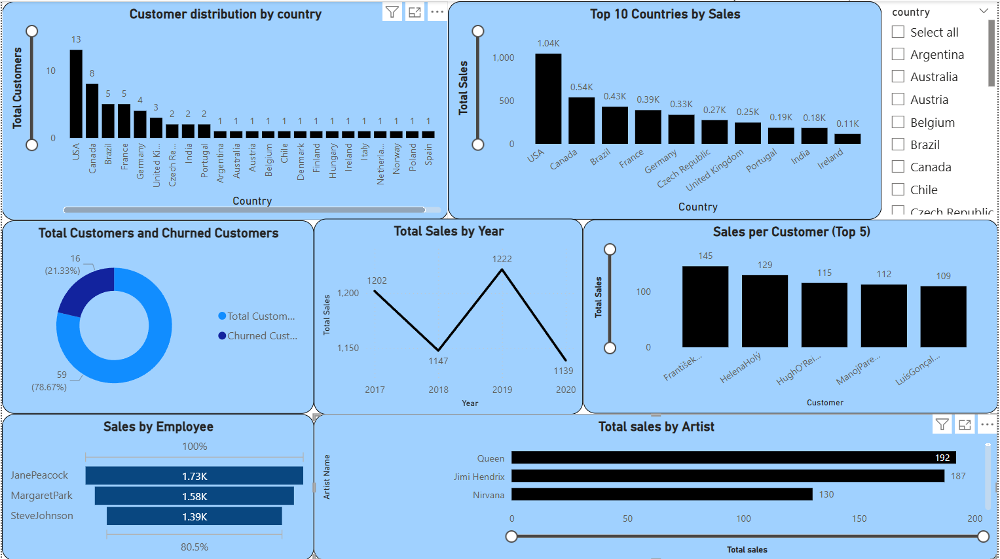
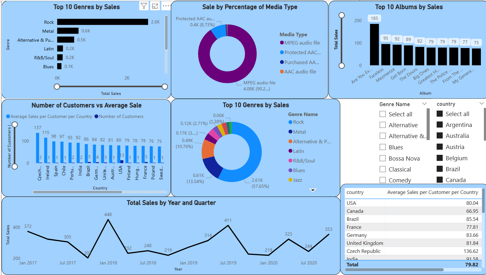
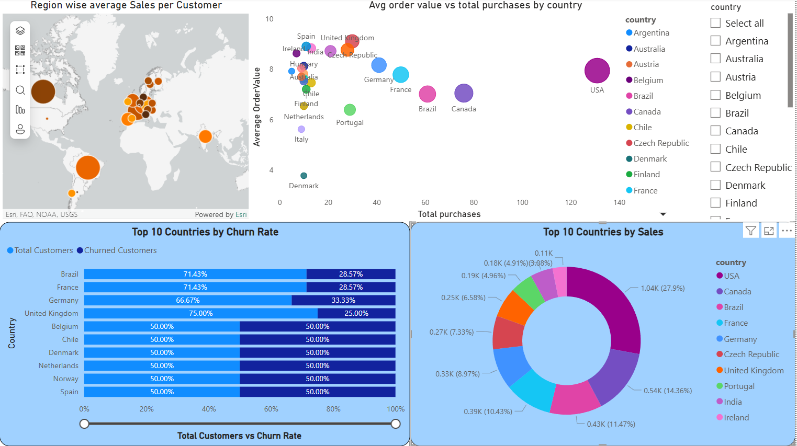

Chinook Music Store — Customer & Sales Analysis
Tools: MySQL · Power BI  
Dataset: Chinook (11 tables · 15,000+ records across customers, invoices, tracks, artists, genres)
---
What this project is about?
Chinook is a fictional digital music store. I used it to answer real business questions — the kind a sales or marketing team would actually ask: who are our best customers, where are we losing them, which genres should we push in which markets, and who's about to churn?
---
Business Questions Answered
#	Question	Technique Used
1	Which tracks and artists sell best in the USA?	Multi-table JOINs, GROUP BY
2	What is our customer churn rate?	CTEs, DATEDIFF, date filtering
3	Who are the top 5 customers by revenue in each country?	CTEs + ROW_NUMBER() window function
4	Which genres dominate outside the USA?	Nested CTEs, RANK()
5	How do new vs loyal customers differ in spend?	CASE WHEN segmentation, AVG aggregation
6	Which customers are high churn risk?	Risk scoring with CASE WHEN
7	What is the lifetime value by customer segment?	CLV modelling with multi-CTE query
---
Key Findings
27.1% churn rate — over 1 in 4 customers had not purchased in 6+ months by end of dataset
Loyal customers (3+ year tenure) spent 2.4× more on average than newer customers ($80.80 vs ~$33)
Rock dominates in the USA, but Latin and Metal lead in Brazil and several European markets — suggesting genre-specific campaigns by region would outperform a global approach
Czech Republic, UK, and India had the highest average spend per customer despite small customer bases — high-value, under-served markets
USA, Canada, Brazil drove the highest total revenue but also had the most high-risk (churned) customers — retention here has the biggest revenue impact
---
SQL Highlights
The queries range from basic aggregations to multi-CTE window function analysis. A few examples:
Customer churn rate using CTEs:
```sql
WITH LastPurchase AS (
    SELECT customer_id, MAX(invoice_date) AS last_purchase_date
    FROM customer c
    JOIN invoice i ON c.customer_id = i.customer_id
    GROUP BY customer_id
),
ChurnedCustomers AS (
    SELECT COUNT(DISTINCT customer_id) AS churned_customers
    FROM LastPurchase
    WHERE last_purchase_date < DATE_SUB('2020-12-31', INTERVAL 6 MONTH)
)
SELECT
    (SELECT COUNT(*) FROM customer) AS total_customers,
    churned_customers,
    ROUND(churned_customers * 100.0 / (SELECT COUNT(*) FROM customer), 2) AS churn_rate
FROM ChurnedCustomers;
```
Top 5 customers per country using window functions:
```sql
WITH CustomerRevenue AS (
    SELECT c.customer_id, c.first_name, c.last_name, c.country,
           SUM(i.total) AS total_revenue
    FROM customer c
    JOIN invoice i ON c.customer_id = i.customer_id
    GROUP BY c.customer_id, c.first_name, c.last_name, c.country
)
SELECT * FROM (
    SELECT *,
           ROW_NUMBER() OVER (PARTITION BY country ORDER BY total_revenue DESC) AS rnk
    FROM CustomerRevenue
) ranked
WHERE rnk <= 5;
```
Full query file: `chinook_queries.sql`
---
Power BI Dashboard
The SQL findings were visualised in Power BI. The dashboard covers:
Revenue by country and city
Customer segmentation (New / Existing / Loyal)
Genre performance by region
Churn risk distribution
> **Note:** To view the `.pbix` file, download it and open in [Power BI Desktop](https://powerbi.microsoft.com/desktop/) (free).  
> Screenshots below 👇
>!--  -->
>!--  -->
>!--  -->
>!--  --> 
---
Recommendations
Launch a win-back campaign targeting the 27% churned customers in USA, Canada, and Brazil — these markets have the highest absolute revenue at risk
Invest in Czech Republic, UK, and India — small customer base but highest spend per person; low acquisition cost, high ceiling
Region-specific genre playlists — Rock for USA, Latin for Brazil, Metal for Germany; generic global campaigns leave revenue on the table
Loyalty programme for 1–3 year customers — this segment spends significantly less than loyal customers despite similar tenure; a structured reward programme could close the gap
---
How to run this yourself
Download the Chinook MySQL database: Chinook on GitHub
Import into MySQL Workbench or any MySQL client
Run `chinook_queries.sql` section by section
Open `database_chinook.pbix` in Power BI Desktop for the dashboard
---
Project by Sanchit Vashishtha · Open to feedback and suggestions
